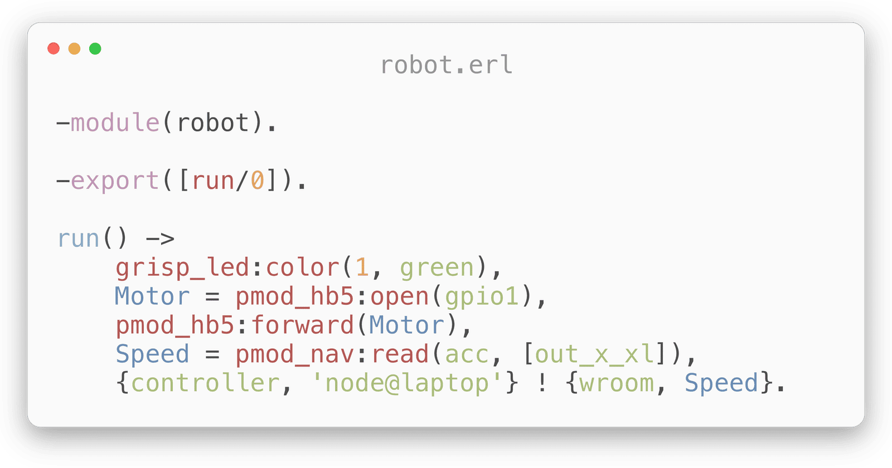

<p>
  <a href="#readme">
    <picture>
      <source media="(prefers-color-scheme: dark)"  srcset="assets/GRiSP_Logotype_negative.svg">
      
    </picture>
  </a>
</p>

<p align="center">
  <a href="https://github.com/grisp/grisp/actions/workflows/continous_integration.yaml?query=branch%3Amaster">
    
  </a>
  <a href="https://hex.pm/packages/grisp">
    
  </a>
  <a href="LICENSE">
    
  </a>
  <a href="https://github.com/grisp/grisp/blob/master/.github/workflows/continous_integration.yaml#L14">
    
  </a>
</p>

<p align="center">
  <a href="https://www.grisp.org">Website</a>
  ·
  <a href="https://github.com/grisp/grisp/wiki">Wiki</a>
  ·
  <a href="https://erlangforums.com/c/erlang-platforms/grisp-forum/67">
    Forums
  </a>
</p>

<p align="center">
  
</p>

Create amazing Internet of Things designs without soldering or dropping down to
C. The GRiSP project makes building internet-connected hardware devices easier
with Erlang!

* Real bare-metal Erlang virtual machine (no operating system!)
* Hard real-time event handling, using open source code
* Digilent Pmod™ compatible connectors for sensors and actuators

This repository contains the Erlang runtime and support code for the GRiSP
hardware platform.

# Getting Started

The easiest way to get started is to use the [Rebar 3][rebar3_plugin] or
[Mix][mix_plugin] plug-ins for GRiSP.

## Erlang

Install the [GRiSP Rebar 3 plug-in][rebar3_plugin] globally by adding `{plugins, [rebar3_grisp]}.` to `~/.config/rebar3/rebar.config`.

Create a new project:

```sh
# Create a new GRiSP application (use the real mount path of your SD card)
rebar3 new grispapp name=demo dest=/path/to/SD-card
cd demo

# Deploy the application to your SD-card
rebar3 grisp deploy
```

# Hardware

GRiSP hardware supports many different connection standards:

* GPIO
* SPI
* UART
* I²C
* 1-Wire

Peripherals can be connected to either [PMOD] ports or I/O
pins directly.

## GRiSP 2 (`grisp2`)


GRiSP 2 ships with the following features:

* 1 × 100 Mbit/s Ethernet port
* 1 × Wi-Fi 802.11b/g/n WLAN
* 1 × GPIO PMOD Type 1A (12-pin)
* 2 × GPIO pins (14-pin & 6-pin)
* 1 × SPI1 PMOD Type 2 (6-pin)
* 1 × SPI2 PMOD Type 2A (12-pin)
* 1 × UART PMOD Type 3A (12-pin)
* 1 × I²C PMOD Type 6 (6-pin)
* 1 × I²C Bus (8-pin)
* 1 × 1-Wire Bus (3-pin)
* 1 × USB Bus (5-pin)
* 5 × mode DIP switches
* 1 × JTAG connector

## GRiSP 1 (`grisp_base`)


GRiSP 1 ships with the following features:

* 1 × Wi-Fi 802.11b/g/n WLAN
* 2 × GPIO PMOD Type 1 (6-pin)
* 1 × UART PMOD Type 3 (6-pin)
* 1 × SPI1 PMOD Type 2A (12-pin)
* 1 × SPI2 PMOD Type 2 (6-pin)
* 1 × I²C Bus (8-pin)
* 1 × 1-Wire Bus (3-pin)
* 5 × mode DIP switches
* 1 × JTAG connector

# Testing

The project has a [hardware emulation layer in software][grisp_emulation] that
allows you to use the runtime locally on a normal computer. To start a local
shell for the runtime use:

```
$ rebar3 as test shell
```

# Glossary

<dl>
  <dt>1-Wire</dt><dd>
    Long-distance serial communication bus.
  </dd>
  <dt>GPIO</dt><dd>
    General Purpose Input/Output. Digital signal pin interface used to
    interface with single pins.
  </dd>
  <dt>I²C</dt><dd>
    Inter-Intergrated Circuit. Short-distance synchronous serial computer bus.
  </dd>
  <dt>JTAG</dt><dd>
    On-chip instrumentation and debugging interface.
  </dd>
  <dt>PMOD</dt><dd>
    A peripheral device that implements the [Digilent Pmod™ connection
    form factor and interface][PMOD].
  </dd>
  <dt>Slot</dt><dd>
    A physical slot where a component can be connected. E.g. `SPI1` where an
    SPI PMOD can be connected.
  </dd>
  <dt>SPI</dt><dd>
    Serial Peripheral Interface. Synchronous serial communication interface.
  </dd>
  <dt>UART</dt><dd>
    Universal Asynchronous Receiver-Transmitter. Asynchronous serial
    communication interface.
  </dd>
</dl>

[PMOD]: https://digilent.com/reference/pmod/start
[rebar3_plugin]: https://github.com/grisp/rebar3_grisp
[mix_plugin]: https://github.com/grisp/mix_grisp
[grisp_emulation]: https://github.com/grisp/grisp_emulation
